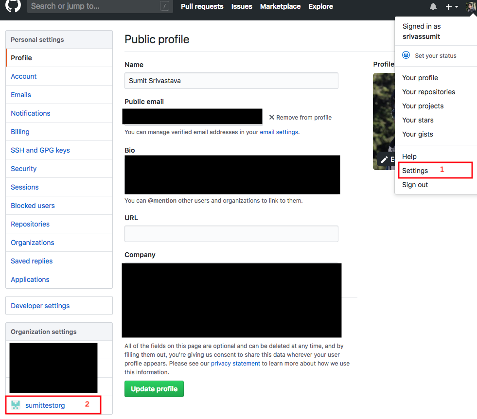
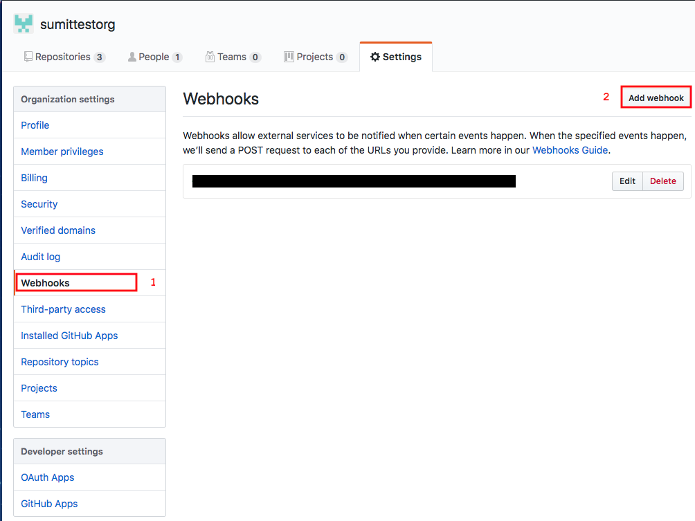

# Gitbot

This is a Git Bot which can post Pull Request from GitHub opened by specific members on to a specific clannel in Slack.

## Prerequisites

You must already have the following resources/accounts created and tools installed.

> Everything used in this project is available for free to Students at the time this demo was created.

- GitHub Account with an organization Created. [Steps](Tutorial/prereq/GithubAccount.md)
- Free Heroku Account. [Steps](Tutorial/prereq/HerokuAccount.md)
- Free Slack Account. [Steps](Tutorial/prereq/SlackAccount.md)
- [Node.js](https://nodejs.org/en/download/package-manager/) and [npm](https://www.npmjs.com/get-npm).

## Step by Step Instructions

### Setup and Deploy Code

1. Fork this repo: `git clone https://github.com/sumittestorg/Gitbot.git`
2. Login to your heroku account and click on `New` > `Create new app` on the top right
3. Give a unique name for your app and click on Create App.
4. In the deploy screen of your app, choose GitHub as the deployment method and give permission to Heroku to access your GitHub Account.
5. In the App connected to GitHub section, search for this forked repo and add click on Connect.
6. In the `Automatic Deploys` section, select `Enable Automatic Deployment` for the `master` branch.
7. Head over to the settings tab and add a `nodejs` buildpack from the `Buildpacks` section.
8. Head back to the deploy tab and click on `Deploy Branch` at the end with the master branch selected in the drop-down.
9. Done! now the githob will be deployed on Heokoku. You can verify this by clicking on the `Open app` button on the top right. which will present you with a welcome screen.

### Add the webhook in GitHub
1. Go To your Organization Settings in GitHub (Settings > select your org from Bottom left corner)
   
2. From Your Organization settings, click on Webhooks from the Right hand menu and then click on Add Webhook. Enter your password if prompted.

3. add the url of your Heroku app which we just deployed in the `Payload URL` box. leave the `Content type` and `Secret` as it is.
4. Choose the `Let me select individual events` option in the `Which events would you like to trigger this webhook?` section and select only the `Pull requests` option.
5. Leave the `Active` checkbox selected and click on `Create Webhook`.
6. Done! Now the App deployed on Heroku will be able to receive a call from GitHub whenever a new Pull Request is [opened, closed, reopened, edited, assigned, unassigned, review requested, review request removed, labeled, unlabeled, or synchronized] on any repository on your organization on GitHub.

### Add Slackbot and Incoming Webhook in slack
1. Create a [Slack App](https://api.slack.com/apps/new) in your Slack workspace. Choose a app name and workspace for your App.
2. Add a bot user to your app by clicking on `Bot Users` from the menu on the left. and click on  `Add a Bot User`.
3. Choose a Display name and Default username for your bot user. You may leave it as the default values. and select `Always Show My Bot as Online` on and click on `Add Bot User`
4. Click on `Incoming webhooks` from the menu on the left and turn on Incoming webhooks.
5. Click on `Add New Webhook to Workspace`, select the channel from your slack workspace where you want the bot to post the messages and click on `Authorize`.
6. Copy the webhook url generated by slack.
7. Go back to Heroku dashboard and open the settings tab of your app. and in the `Config Vars` section, create a new Config Var with Key = `SLACK_WEBHOOK` and value = the webhook url you copied in previous step.
8. Go to Deploy tab and do a manual deployment again by clicking on `Deploy Branch` at the end.
9. Done! Now yout GitBot will be able to communicate to slack and send messages to the channed that you specified in Step 5.